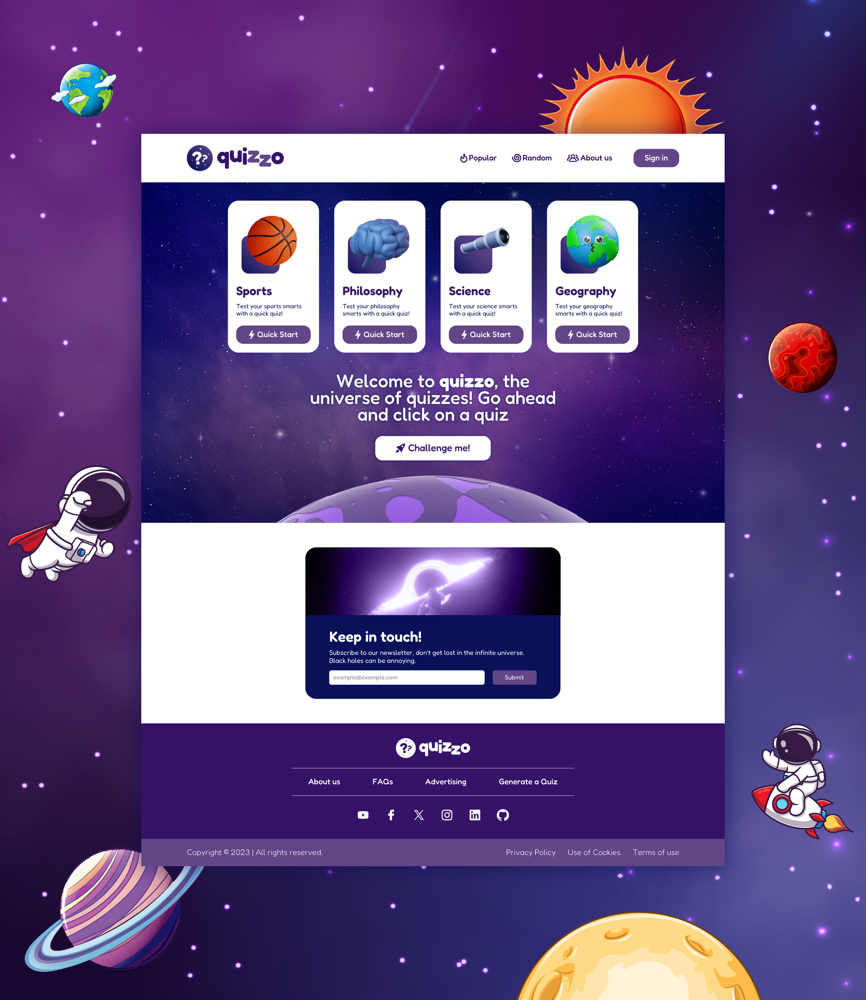
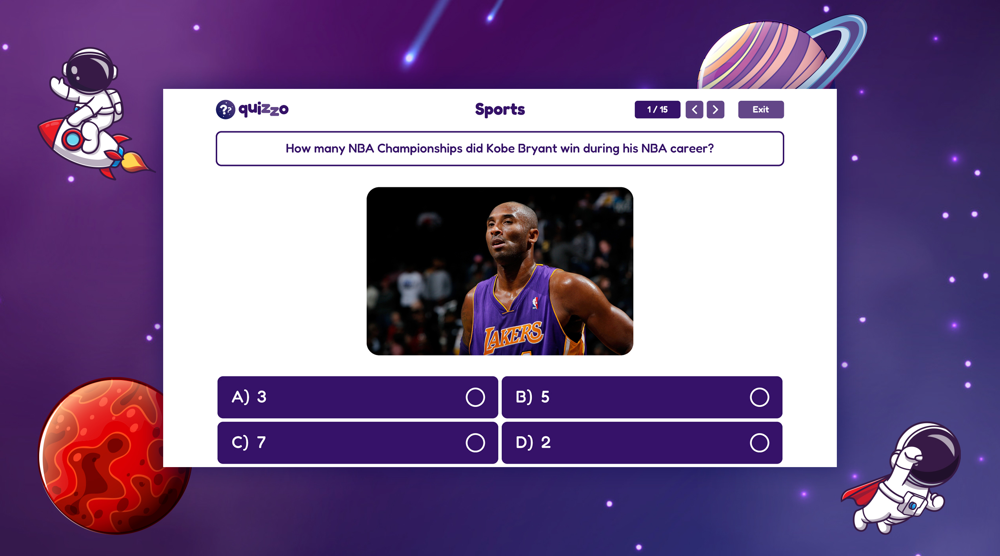

# 🏆 Quizzo Quiz App

Hello everybody! 😊

🚶‍♂️ I would like to thank everyone who contributed to the Quizzo Quiz App, which we did as a group with the guidance of our mentor and teacher Alptuğ Türkiş at Bilge Adam Education.

## 🗿 Overview

### 📷 Screenshots




💯 All the designs of this project belong to me, so I am also proud of it. With the help of my friends, we achieved a beautiful result.

### 🔗 Links

- CodeSandbox URL: [https://prdyrz.csb.app/](https://prdyrz.csb.app/)
- Live Site URL: [https://yavuzkarakus.github.io/quizzoApp/](https://yavuzkarakus.github.io/quizzoApp/)

## 🚀 My process

### ⚡ Built with

- Using CSS gradient
- CSS animation usage
- Semantic HTML5 markup
- CSS custom properties
- Flexbox
- Grid
- Mobile-friendly full responsive.

### 👾 What I learned

What I learned in this project is that in group work, I experienced again being part of the group and working harmoniously in the group. I learned how to combine a project if it is developed by several developers. I also learned that when designing, you should definitely think about the design for the developers, not for the design. In addition, I learned that I can use `position absolute` in a comfortable way by giving `position relative` to its parent.

CSS Code Snippet:

```css
.card-component {
  position: relative;
}

.card-component .gradient {
  position: absolute;
}
```

### 💪 Continued development

Of course, I don't want to leave this project this way, I want to move forward with our friends by adding more innovations. Now we are on JavaScript with our teacher Alptuğ Türkiş. In the following process, we will pull data to Quizzo and make a real quiz application. So stay tuned!!!

## 🚩 Author

- Yavuz Karakuş - [@yavuzkarakus](https://github.com/yavuzkarakus)

## 📒 Notes

🚶‍♂️ I plan to continue these challenges as long as I can. If you are interested in these topics, don't forget to tune in and follow me.

⭐ If you liked this project and the challenge, please don't forget to star it.

## 🙏🏼 Special Thanks

I would like to thank our mentor and teacher Alptuğ Türkiş, who answered our questions tirelessly.

- Alptuğ Türkiş - [@alptugturkis](https://github.com/carpediem23)
